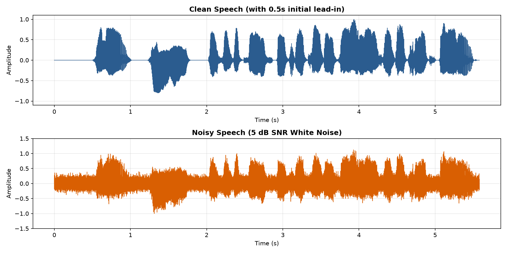
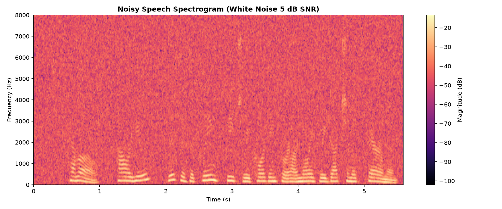
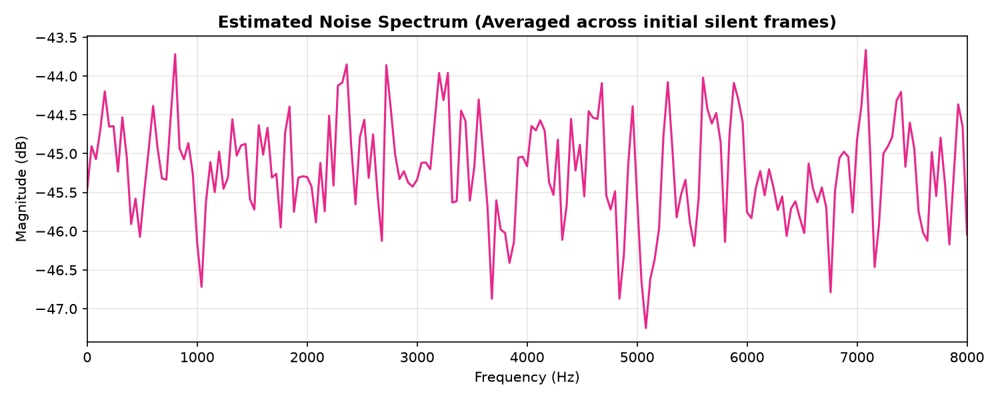
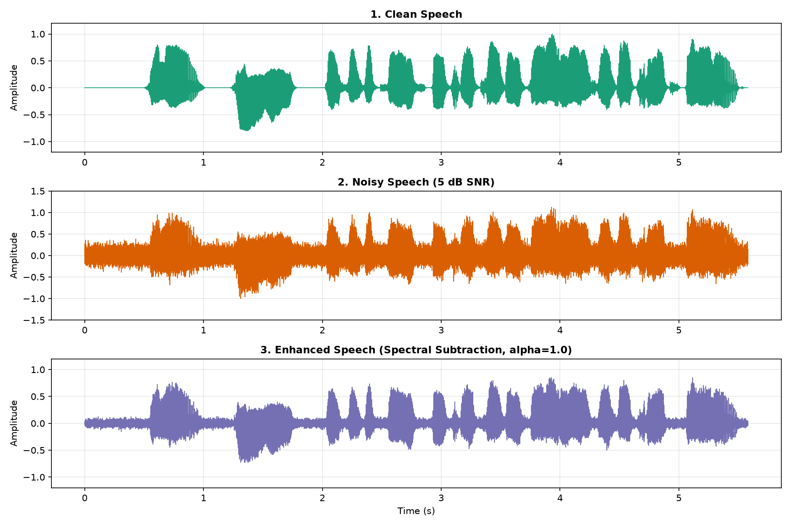
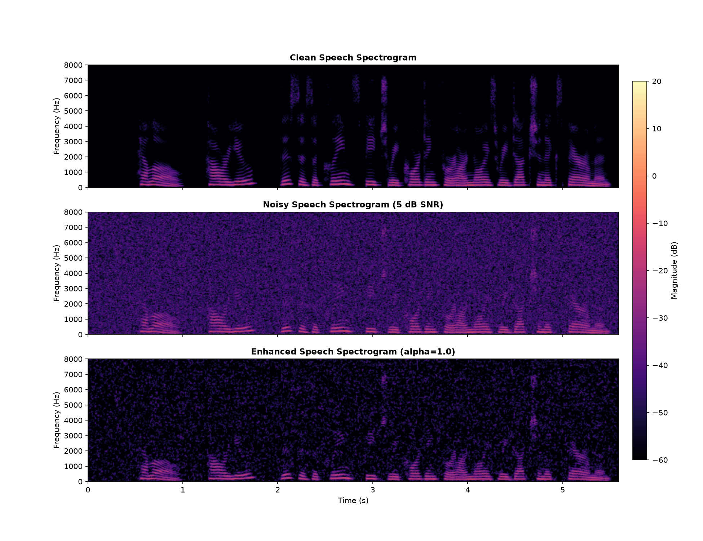
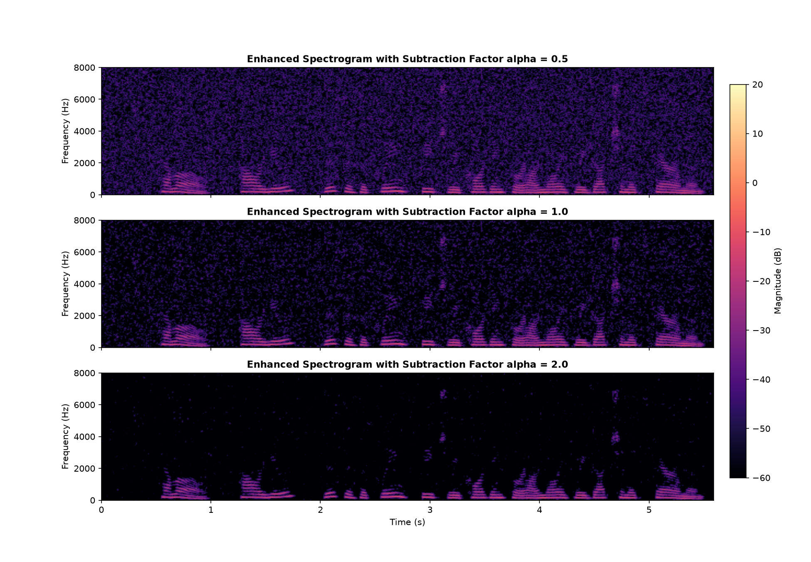

# 🎙️ Classical Noise Reduction: Spectral Subtraction in Python

[](https://www.python.org/)
[](https://opensource.org/licenses/MIT)
[](https://scipy.org/)

An end-to-end implementation of **Spectral Subtraction** for speech enhancement and audio noise reduction in pure Python (no Machine Learning / PyTorch required).

---

## 📌 Pipeline Architecture

```
 Clean Speech (16 kHz)
          │
          ▼
   + White Gaussian Noise (5 dB SNR)
          │
          ▼
     Noisy Speech
          │
          ▼
 Short-Time Fourier Transform (STFT)
    [ 25 ms Hann Window, 10 ms Hop ]
          │
          ├───► Magnitude: |Y(f, t)|
          └───► Phase: ∠Y(f, t)
          │
          ▼
 Noise Estimation: N̂(f)
    (Averaged over initial 0.5s silence)
          │
          ▼
 Magnitude Subtraction:
    |X̂(f, t)| = max(|Y(f, t)| - α · N̂(f), 0)
          │
          ▼
 Phase Recombination:
    X̂(f, t) = |X̂(f, t)| · exp(j · ∠Y(f, t))
          │
          ▼
 Inverse STFT (ISTFT)
          │
          ▼
 Enhanced Speech Waveform ✨
```

---

## 📊 Visual Results & Analysis

### 1. Clean vs. Noisy Waveform (5 dB SNR)
White Gaussian noise added at a controlled 5 dB Signal-to-Noise Ratio (SNR):



---

### 2. Noisy Spectrogram
Broadband energy floor across all frequency bins ($0\text{--}8000\text{ Hz}$):



---

### 3. Estimated Noise Spectrum
Computed by averaging STFT magnitude frames across the initial silent lead-in ($0.5\text{ s}$, $51$ frames):



---

### 4. Waveform Comparison (Clean vs. Noisy vs. Enhanced)
Comparing time-domain dynamics across all three stages:



---

### 5. Spectrogram Comparison (Before & After Enhancement)
Notice the suppression of the background noise floor while preserving the harmonic speech formant structures:



---

### 6. Subtraction Factor ($\alpha$) Exploration

$$\hat{X}_{\text{mag}}(f, t) = \max\left(|Y(f, t)| - \alpha \cdot \hat{N}(f), \; \beta \cdot \hat{N}(f)\right)$$



| $\alpha$ Value | Trade-off | Auditory Quality |
| :--- | :--- | :--- |
| **$\alpha = 0.5$** (Under-subtraction) | Preserves speech naturalness | Residual background hiss, minimal speech distortion |
| **$\alpha = 1.0$** (Balanced) | Standard baseline subtraction | Substantial noise reduction, subtle musical noise in gaps |
| **$\alpha = 2.0$** (Over-subtraction) | Deep noise suppression | Complete silence in pauses, slightly metallic/hollow voice |

---

## 🧮 Theoretical Background

### Why Spectral Subtraction?
In the time domain, speech and additive noise are mixed:
$$y[n] = x[n] + d[n]$$

In the frequency domain via Short-Time Fourier Transform (STFT):
$$Y(f, t) = X(f, t) + D(f, t)$$

Assuming speech $x[n]$ and noise $d[n]$ are uncorrelated, their power spectral densities add linearly:
$$|Y(f, t)|^2 \approx |X(f, t)|^2 + |D(f, t)|^2$$

Spectral subtraction estimates the clean magnitude by subtracting the estimated noise spectrum $\hat{N}(f)$:
$$|\hat{X}(f, t)| = \max\left(|Y(f, t)| - \alpha \hat{N}(f), \; 0\right)$$

The time-domain enhanced signal is reconstructed by preserving the original noisy phase $\angle Y(f, t)$:
$$\hat{X}(f, t) = |\hat{X}(f, t)| \cdot e^{j \angle Y(f, t)}$$
$$\hat{x}[n] = \text{ISTFT}\{\hat{X}(f, t)\}$$

---

## 🚀 Quickstart & Reproduction

### 1. Clone the repository
```bash
git clone https://github.com/GlieseCc212/noise-reduction-spectral-subtraction.git
cd noise-reduction-spectral-subtraction
```

### 2. Install dependencies
```bash
pip install numpy scipy matplotlib soundfile
```

### 3. Run the pipeline
```bash
python noise_reduction.py
```

Generated audio outputs (`clean.wav`, `noisy.wav`, `enhanced.wav`, `enhanced_alpha_*.wav`) and visualizations will be saved to the `./output/` directory.

---

## 📁 Repository Structure
```
.
├── clean.wav                    # Reference 16 kHz clean speech sample
├── noise_reduction.py           # Core Spectral Subtraction pipeline
├── output/                      # Output audio and visualization plots
│   ├── clean.wav
│   ├── noisy.wav
│   ├── enhanced.wav
│   ├── enhanced_alpha_0.5.wav
│   ├── enhanced_alpha_1.0.wav
│   ├── enhanced_alpha_2.0.wav
│   ├── step8_clean_vs_noisy_waveform.png
│   ├── step12_noisy_spectrogram.png
│   ├── step14_noise_spectrum.png
│   ├── step19_waveform_comparison.png
│   ├── step20_spectrogram_comparison.png
│   └── alpha_comparison_spectrograms.png
└── README.md
```

---

## 📜 License
MIT License. Feel free to use and experiment!
